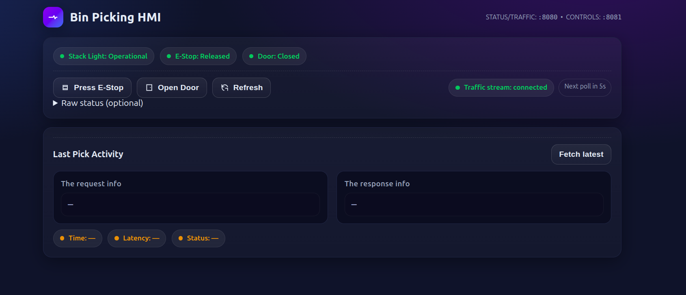
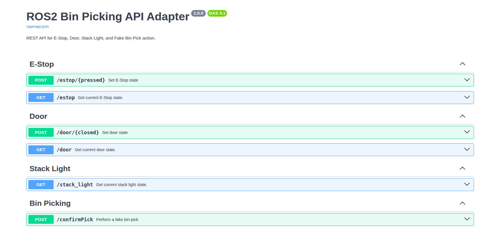
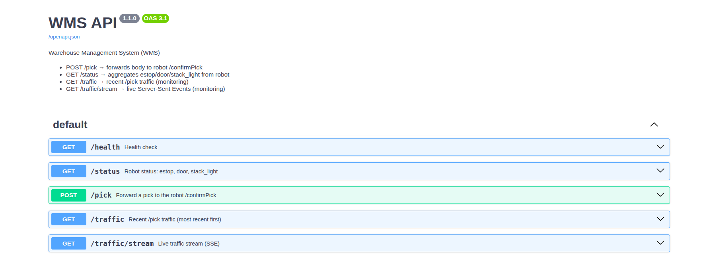

# Bin Picking Mockup

### Index

- [Overview](#overview)
- [ROS2 Package](#ros2-package)
  - [barcode_publisher](#barcode_publisher)
  - [door_state_handler](#door_state_handler)
  - [estop_handler](#estop_handler)
  - [stack_light_handler](#stack_light_handler)
  - [fake_bin_picking_node (Action Server)](#fake_bin_picking_node-action-server)
  - [Uses Executors](#uses-executors)
- [API Layer](#api-layer)
  - [Robot Adapter API](#robot-adapter-api)
    - [E-Stop](#estop)
    - [Door](#door)
    - [Stack Light](#stack-light)
    - [Fake Bin Picking](#fake-bin-picking)
    - [Swagger UI](#swagger-ui)
  - [WMS API](#wms-api)
    - [Pick Endpoint](#main-pick-endpoint)
    - [Robot Status](#robot-status)
    - [Traffic Monitoring](#traffic-monitoring)
    - [Health](#health)
    - [Notes](#notes)
- [HMI](#hmi-human-machine-interface)
- [Installation](#installation)
  - [Prerequisites](#prerequisites)
  - [Option 1: Clone via GitHub](#option-1-clone-via-github)
  - [Option 2: Download ZIP file](#option-2-download-zip-file)
  - [Build ROS2 Workspace](#build-ros2-workspace)
  - [API Environment Setup](#api-environment-setup)
- [Usage (Local Setup)](#usage-local-setup)
- [Usage (Docker)](#usage-docker)
  - [Verifying Docker Setup](#verifying-docker-setup)
  - [Accessing the Application](#accessing-the-application)
    - [HMI](#hmi)
    - [Robot Adapter API (Swagger UI)](#robot-adapter-api-swagger-ui)
    - [WMS API (Swagger UI)](#wms-api-swagger-ui)
- [Compatibility](#compatibility)
- [Improvements](#improvements)
- [References and Acknowledgements](#references-and-acknowledgements)

## Overview

The **Bin Picking Mockup** is a ROS2-based package designed to simulate a bin picking task environment. It integrates Human-Machine Interface (HMI), ROS2 nodes, and REST APIs to provide a complete mockup system for testing and prototyping.

This package provides:

- **ROS2 package** for bin picking mockup simulation
- **API services** for robot and WMS (Warehouse Management System) integration
- **HMI elements** to visualize and control the mockup

---

## ROS2 Package

The ROS2 package simulates the bin picking task environment with the following features:

- **Barcode simulation** – Mock barcode generation for picked parts
- **Stacklight indication** – Emulates industrial stacklight signals (red, yellow, green)
- **E-stop simulation** – Emergency stop trigger and reset handling
- **Door indication and controls** – Simulates door status and interlocks
- **Bin picking task mockup** – Provides a virtual bin picking workflow for integration and testing

### `barcode_publisher`

- **Purpose**:
  This node continuously publishes a synthetic barcode value as a 5-digit number.
  - Example output: `48291`

- **What this node does**:
  - Generates a new random 5-digit number at a fixed interval.
  - Publishes this number as the "barcode" on the `/barcode` topic.
  - Exposes a service `/get_barcode` that allows clients to request the most recently published barcode.

- **Interfaces**:
  - **Topic:** `/barcode` → continuously streams newly generated barcodes.
  - **Service:** `/get_barcode` → provides the most recent barcode on-demand.

### `door_state_handler`

- **Purpose**:
  This node represents the **state of the safety door** in the bin picking setup. The door can either be *open* or *closed*.

- **Implementation**:
  The node exposes a **service** for updating door state at runtime, which is a practical interface for HMI and integration testing.

- **What this node does**:
  - Publishes a boolean state indicating whether the door is closed.
    - `true` → door is closed
    - `false` → door is open
  - Provides a service to **set the state of the door**, allowing external systems or users to explicitly define whether the door should be open or closed.

- **Interfaces**:
  - **Topic:** `/door_closed` → continuously publishes the current door state (`true`/`false`).
  - **Service:** `/set_door_state` → sets the door state based on the service request (`true` for closed, `false` for open).

### `estop_handler`

- **Purpose**:
  This node represents the **emergency stop button** in the bin picking setup. The button can either be *pressed* or *released*.

- **Implementation**:
  The node exposes a service interface:
  - **`set_estop_state`** → sets the button state to `true` (pressed) or `false` (released).
  - The node continuously publishes the state on a topic, providing real-time feedback.
  This mirrors how an actual safety system could be tested programmatically and monitored.

- **What this node does**:
  - Publishes a boolean state indicating whether the emergency stop button is pressed.
    - `true` → button is pressed
    - `false` → button is released
  - Provides a service to **press or release the button**, allowing external systems or users to simulate E-stop behavior.

- **Interfaces**:
  - **Topic:** `/estop_pressed` → continuously publishes the current E-stop state (`true`/`false`).
  - **Service:** `/set_estop_state` → sets the E-stop state based on the service request (`true` for pressed, `false` for released).

### `stack_light_handler`

- **Purpose**:
  This node simulates the **stack light** in the bin picking setup, which indicates the system status using different colors or states.

- **Behavior**:
  The node publishes stack light state based on system conditions:
  - `0` → operational (green)
  - `1` → pause (yellow, e.g., door open)
  - `-1` → E-stop pressed (red)
  Additionally, the node must react to changes in the E-stop and door state by subscribing to their respective topics.

- **Design Decision**:
  To reflect realistic industrial behavior, the node **subscribes to `/estop_pressed` and `/door_closed` topics** and updates its state accordingly:
  - If the E-stop is pressed → stack light = `-1`
  - If the door is open → stack light = `1`
  - Otherwise → stack light = `0` (operational)
  This allows the stack light to dynamically reflect the current safety and operational state.

- **What this node does**:
  - Monitors `/estop_pressed` and `/door_closed` topics.
  - Calculates the current stack light state based on the latest values from E-stop and door.
  - Publishes the stack light state on `/stack_light` topic.

- **Interfaces**:
  - **Subscriptions:**
    - `/estop_pressed` → boolean, indicates if E-stop is pressed
    - `/door_closed` → boolean, indicates if door is closed
  - **Topic:** `/stack_light` → publishes the current stack light state (`0`, `1`, `-1`)

### `fake_bin_picking_node` (Action Server)

- **Purpose**:
  This node simulates a **bin picking task** using a ROS2 Action Server. It provides feedback, handles goal acceptance, cancellation, and abort scenarios, mimicking a real robot picking process.

- **Design Decisions**:
  - Implemented as an **action server** (`fake_bin_pick`) to allow asynchronous task execution with feedback and result reporting.
  - Subscribes to **E-stop** and **door state topics** (`/estop_pressed` and `/door_closed`) to ensure safety conditions are respected.
  - Integrates with the **barcode service** (`/get_barcode`) to assign a barcode to each completed pick.
  - Handles goal cancellation, abortion (if door opens or E-stop is pressed), and successful completion, simulating realistic robot task behavior.

- **What this node does**:
  1. **Goal Handling**:
     - Rejects new goals if E-stop is pressed or the door is open.
     - Accepts safe goals for execution.
  2. **Task Execution**:
     - Simulates picking over 10 steps, publishing feedback (`percent_complete`) every 500ms.
     - Monitors door and E-stop during execution:
       - If conditions become unsafe, the goal is aborted with an appropriate message.
       - Supports goal cancellation at any time.
  3. **Result**:
     - On success, returns `success = true`, a message "Pick Successful," and the barcode retrieved from the barcode service.
     - On abort or cancel, returns `success = false` and a relevant message.

- **Interfaces**:
  - **Subscriptions:**
    - `/estop_pressed` → boolean, monitors emergency stop status
    - `/door_closed` → boolean, monitors door status
  - **Service Client:**
    - `/get_barcode` → retrieves the most recent barcode to associate with the pick
  - **Action Server:**
    - `fake_bin_pick` → accepts bin picking goals, provides feedback, and returns results

- **Behavior Summary**:
  - Continuously monitors system safety conditions.
  - Provides realistic feedback during task execution.
  - Simulates a complete pick cycle with success, cancellation, and abort handling.
  - Integrates seamlessly with the rest of the mockup nodes to provide a cohesive simulation environment.
### Uses Executors

All the nodes are run **concurrently using ROS2 multi-threaded executors** directly in `main.cpp`. This allows multiple nodes—such as the barcode publisher, door handler, E-stop handler, stacklight handler, and fake bin picking action server—to operate at the same time as a single system.

---

## API Layer

The API layer provides REST endpoints and ROS2 adapters for external system integration. It contains:

### Robot Adapter API

- A ROS2-to-API adapter that exposes ROS2 functionality through REST endpoints
- Allows external systems to control and monitor the robot mockup

---
#### Endpoints

#### **E-Stop**

- **POST** `/estop/{pressed}`
  Set E-Stop state (`true` to press, `false` to release).
  Internally calls `/set_estop_state` service.
  **Note:** Needed to control E-Stop from the HMI.

- **GET** `/estop`
  Returns the current E-Stop state from `/estop_pressed` topic.

---

#### **Door**

- **POST** `/door/{closed}`
  Set door state (`true` to close, `false` to open).
  Internally calls `/set_door_state` service.
  **Note:** Needed to control door state from the HMI.

- **GET** `/door`
  Returns the current door state from `/door_closed` topic.

---

#### **Stack Light**

- **GET** `/stack_light`
  Returns the latest `/stack_light` topic value.
  - `0` → Operational
  - `1` → Pause (door open)
  - `-1` → E-Stop pressed
  - Other → Unknown

---

#### **Fake Bin Picking**

- **POST** `/confirmPick`
  Performs a fake bin pick via `/fake_bin_pick` action.
  Request body:
```json
{
  "pickId": 123,
  "quantity": 1
}
```

- `pickId` is used as the action goal.
- `quantity` is currently ignored; the endpoint processes a single simulated pick per request.
- **Response**:

  ```json
  {
  "pickId": 123,
  "pickSuccessful": true,
  "errorMessage": null,
  "itemBarcode": 48291
  }
  ```
- `pickId` → same as request
- `pickSuccessful` → `true` if pick succeeded, `false` otherwise
- `errorMessage` → contains failure reason if `pickSuccessful` is `false`
- `itemBarcode` → barcode of the picked item from the barcode publisher

---
- #### Swagger UI

  All endpoints can be accessed interactively via: [http://localhost:8081/docs](http://localhost:8081/docs)


### WMS API

- Provides endpoints for **pick actions** and **status updates**
- Designed to integrate with a Warehouse Management System (WMS) to simulate realistic bin picking task flow

---
#### Endpoints

#### **Main Pick Endpoint**

  - **POST** `/pick`
    Forwards the pick request to the robot adapter `/confirmPick` endpoint.
    - **Request Body**:
  ```json
  {
    "pickId": 123,
    "quantity": 1
  }
  ```
  - `pickId` → task identifier
  - `quantity` → accepted but currently ignored
  - **Response** → mirrors robot adapter `/confirmPick` response:

    ```json
    {
    "pickId": 123,
    "pickSuccessful": true,
    "errorMessage": null,
    "itemBarcode": 48291
    }
    ```
  - **Decision Behind Implementation**:

    The implementation uses the following workflow:
  - The WMS API acts as the **server that receives pick requests** (`/pick`) from the WMS system.
  - The Robot Adapter API acts as the **client that actually performs the pick** (faked via `/confirmPick`).
  - `/pick` on the WMS side is synchronous: it waits for the robot adapter to complete the pick and returns the result to the WMS.

---
- #### **Robot Status**
  - **GET** `/status`

    Aggregates current robot state by querying the robot adapter endpoints:
    - `/estop` → E-Stop state
    - `/door` → Door state
    - `/stack_light` → Stack light state

---
- #### **Traffic Monitoring**
  - **GET** `/traffic`

    Returns the most recent `/pick` requests for monitoring or debugging.
  - **GET** `/traffic/stream`

    Provides a live stream of `/pick` traffic using Server-Sent Events (SSE). Includes a replay of the last ~50 requests upon connection.

---
- #### **Health**
  - The **`/health`** endpoint is a simple health check for the WMS API.

    It does the following:
  - Confirms that the WMS API server is running.
  - Checks whether the `ROBOT_BASE_URL` environment variable is configured, which indicates if the WMS API can communicate with the Robot Adapter API.

    **Response example:**

    ```
    {
    "ok": true,
    "robot_base": true
    }
    ```
  - `"ok": true` → WMS API is up.
  - `"robot_base": true` → Robot Adapter URL is configured.
  - `"robot_base": false` → Robot Adapter URL is missing, so WMS cannot forward pick requests.

- #### Notes
- **Concurrency**: `/pick` is a synchronous endpoint; it blocks until the robot adapter completes the fake pick.
- **Integration**: The WMS API depends on the `ROBOT_BASE_URL` environment variable pointing to the robot adapter API.

---
### HMI (Human-Machine Interface)
  The HMI is a browser-based dashboard that allows operators to visualize the current state of the bin-picking cell and monitor pick activity in real-time.

  **Features shown on the HMI:**
  - **Request Info:** Displays the most recent pick request received by the WMS API.
  - **Response Info:** Shows the result returned by the Robot Adapter API for the last pick.
  - **E-Stop State:** Current state of the emergency stop button.
  - **Door State:** Current state of the safety door.
  - **Stack Light State:** Displays operational status:
    - `0` → green (operational)
    - `1` → yellow (pause / door open)
    - `-1` → red (E-Stop pressed)

  All information updates live, using a combination of polling and server-sent events (SSE) for traffic updates. The E-Stop and Door controls can also be triggered from the HMI, connecting directly to the Robot Adapter API.

  > **Note:** This HMI implementation was completely generated by ChatGPT.


## Installation

### Prerequisites

- [ROS2 Jazzy](https://docs.ros.org/en/jazzy/index.html) or [ROS2 Humble](https://docs.ros.org/en/humble/index.html))installed
- Python 3 and `virtualenv` for API environment

---

### Option 1: Clone via GitHub

```bash
mkdir -p ~/ros2_ws/src
cd ~/ros2_ws/src
git clone https://github.com/ShreyasManjunath/bin_picking_mockup.git

```

- ### Option 2: Download ZIP file

  ```bash
  cd ~/ros2_ws/src
  unzip /path/to/bin_picking_mockup.zip -d .
  ```

---

- ### Build ROS2 Workspace

  ```bash
  source /opt/ros/jazzy/setup.bash
  cd ~/ros2_ws
  rosdep install --from-paths . --ignore-src -y --rosdistro jazzy
  colcon build \
  --cmake-args -DCMAKE_BUILD_TYPE=RelWithDebInfo \
                -DCMAKE_CXX_FLAGS=-fdiagnostics-color=always \
                -DBUILD_TESTING=OFF \
  --parallel-workers 16 \
  --event-handler console_direct+
  source ~/ros2_ws/install/setup.bash
  ```

---

- ## API Environment Setup

  ```bash
  cd ~/ros2_ws/src/bin_picking_mockup
  virtualenv --python=python3.12 venv
  source venv/bin/activate
  pip install -r api/requirements.txt
  ```

  > Adjust Python version according to your system.

---

- ## Usage (Local Setup)

  This section explains how to run the bin picking mockup locally on Linux.

- ### 1. Source the ROS2 Workspace

  ```bash
  source ~/ros2_ws/install/setup.bash
  ```

  >

  Must be done in every terminal used.

---

- ### 2. Launch the Bin Picking Mockup ROS2 Node

  Open a **new terminal**:

  ```bash
  source ~/ros2_ws/install/setup.bash
  ros2 launch bin_picking_mockup bin_picking_mockup.launch.py
  ```

  This starts the ROS2 nodes for the mockup (HMI simulation, stacklight, barcode, E-stop, and door indications).

---

- ### 3. Run Robot Adapter

  Open another **new terminal**:

  ```bash
  cd ~/ros2_ws/src/bin_picking_mockup
  source venv/bin/activate
  source ~/ros2_ws/install/setup.bash
  uvicorn robot_adapter:app --host 0.0.0.0 --port 8081
  ```

---

- ### 4. Run WMS API

  Open **another new terminal**:

  ```bash
  cd ~/ros2_ws/src/bin_picking_mockup
  source venv/bin/activate
  source ~/ros2_ws/install/setup.bash
  ROBOT_BASE_URL=http://localhost:8081 uvicorn wms_api:app --host 0.0.0.0 --port 8080
  ```

---

- ### 5. Run the HMI

  Open **another new terminal**:

  ```
  cd ~/ros2_ws/src/bin_picking_mockup/hmi
  python3 -m http.server 8082
  ```

- Access the HMI in your browser at [http://localhost:8082](http://localhost:8082)
- ⚠️ Make sure the ROS2 nodes and API services are running first.

  **Optional:** Start server from anywhere:

  ```bash
  python3 -m http.server 8082 --directory ~/ros2_ws/src/bin_picking_mockup/hmi
  ```

---

## Usage (Docker)

To run the Bin Picking Mockup using Docker, ensure you have **Docker v2** installed and configured as a non-root user. Installation instructions:

- [Docker Desktop / Engine](https://docs.docker.com/get-docker/)
- [Manage Docker as a non-root user](https://docs.docker.com/engine/install/linux-postinstall/)

> The user is assumed to be already logged into the Docker registry.

---

### Steps

- Navigate to the root folder of the repository containing `docker-compose.yaml` and `.env`:

```bash
cd ~/ros2_ws/src/bin_picking_mockup
```

or

- Clone the repo again to your desired directory.

```bash
git clone https://github.com/ShreyasManjunath/bin_picking_mockup.git
cd /path/to/bin_picking_mockup
```

- Pull the docker images

```bash
docker compose -f docker-compose.yaml pull
```
  This pulls:

  ```bash
  shreyasmanjunath/bin-picking-mockup:latest
  traefik:v3.4.3
  ```

- Run the containers using Docker Compose:

```bash
docker compose -p task up -d
```

> The -p task prefix is optional and can be replaced with any project name.

Alternatively, for explicit .env usage:

```bash
docker compose -f docker-compose.yaml --env-file .env -p task up -d
```

## Verifying Docker Setup

After running Docker Compose, you should see containers created and started. Example output:

```bash
✔ Container task-wms-api-1 Started
✔ Container task-reverse-proxy-1 Started
✔ Container task-bin-picking-mockup-1 Started
✔ Container task-hmi-1 Started
✔ Container task-robot-api-1 Started
```

#### Notes

- **task-wms-api-1** – WMS API service
- **task-reverse-proxy-1** – Reverse proxy for routing requests
- **task-bin-picking-mockup-1** – ROS2 bin picking mockup nodes
- **task-hmi-1** – HMI service
- **task-robot-api-1** – Robot Adapter API

---

## Accessing the Application

Once everything is running, you can open the following in your browser to interact with the system.


### HMI
- **Local Setup URL:** [http://localhost:8082](http://localhost:8082)
- **Docker Setup URL (default):** [http://localhost:1000](http://localhost:1000)
- **What you will see:**
  A web-based control panel that provides:
  - **Stacklight indication** (red/yellow/green)
  - **E-stop and door status indicators**
  - **Controls for toggling estop and door**
  - **Pick request and response details**



- To trigger a pick task, visit WMS API swagger ui at [http://localhost:8080/docs](http://localhost:8080/docs) to use the /pick endpoint. Ref: [WMS API (Swagger UI)](#wms-api-swagger-ui).

- If you want to use curl, use the following command. Change the pickId and quantity accordingly.

```bash
curl -X 'POST' \
  'http://localhost:8080/pick' \
  -H 'accept: application/json' \
  -H 'Content-Type: application/json' \
  -d '{
  "pickId": 123,
  "quantity": 4
}'
```

### Robot Adapter API (Swagger UI)
- **URL (both Local & Docker):** [http://localhost:8081/docs](http://localhost:8081/docs)
- **What you will see:**
  An interactive Swagger UI listing all Robot Adapter API endpoints. You can:
  - Trigger robot pick action on /confirmPick
  - Query estop, door and stack light status
  - Control estop and door



### WMS API (Swagger UI)
- **URL (both Local & Docker):** [http://localhost:8080/docs](http://localhost:8080/docs)
- **What you will see:**
  An interactive Swagger UI for WMS endpoints. This allows you to:
  - Send pick action requests and get synchronous responses
  - Query the status of the robot system on /status
  - Provides endpoint for listening to pick requests traffic
  - Provides /health endpoint for robot_adapter and wms_api




---
## Compatibility

- The ROS 2 code is compatible with both ROS 2 Jazzy and Humble distributions.

- If you are using Docker with Humble, there is a prebuilt image available:

```bash
shreyasmanjunath/bin-picking-mockup-humble:latest
```

- Use the provided Docker Compose file for Humble:

```bash
docker-compose -f docker-compose-humble.yaml -p task up -d
```

- The HMI port is configurable via the .env file. By default, for Docker setup, it runs on port 1000. You can change this by setting a different value in .env before starting the container.

## Improvements

- Enable SSL/TLS: Secure communication for both the WMS API and Robot Adapter API.

- Asynchronous Pick Requests: Convert the /pick endpoint to async to improve performance and avoid blocking while waiting for /confirmPick responses.

- Auto-routing with Traefik: Use Traefik for dynamic API routing, allowing easier service discovery and load balancing for multiple endpoints.

## References and Acknowledgements

- ROS2 Jazzy docs: [Jazzy](https://docs.ros.org/en/jazzy/index.html)
- ChatGPT: Full HMI code and some parts of API code.
